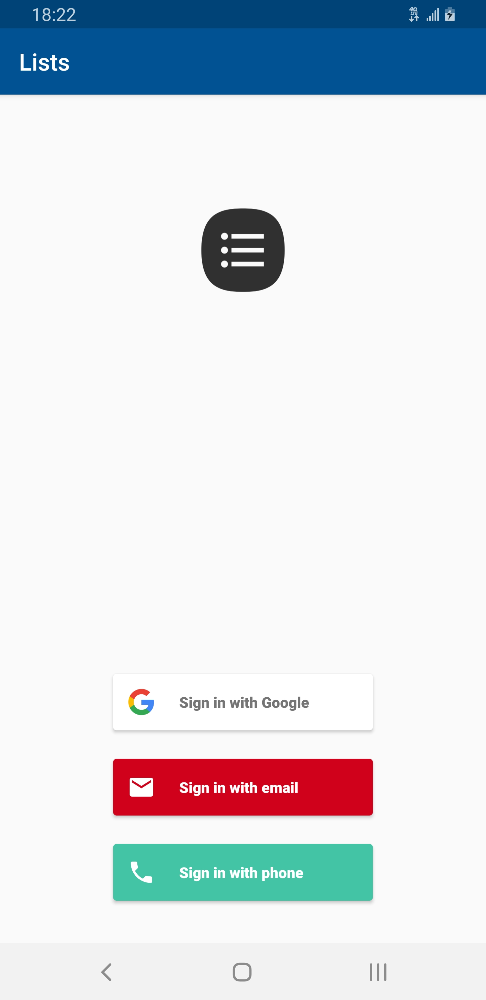
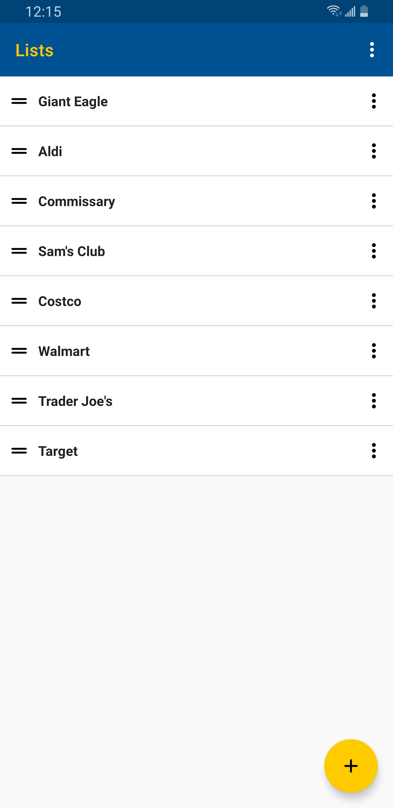
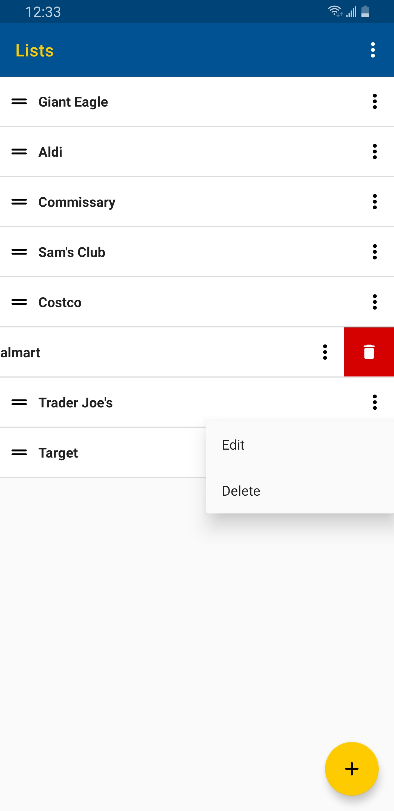
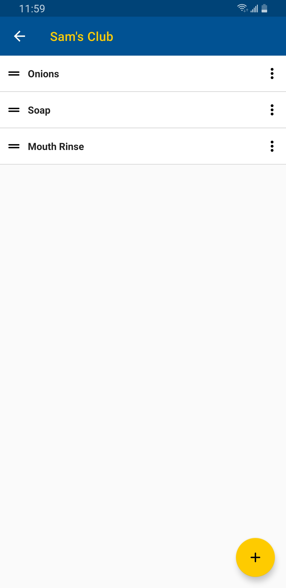
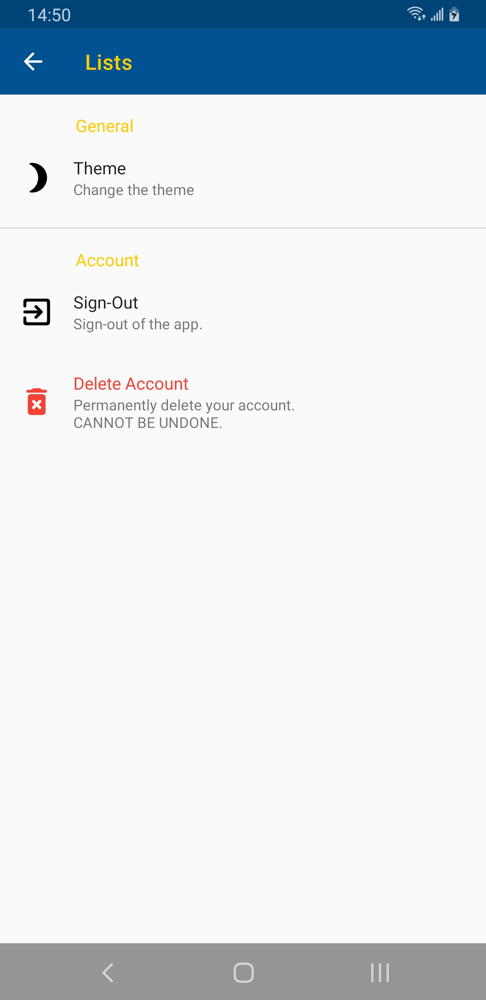
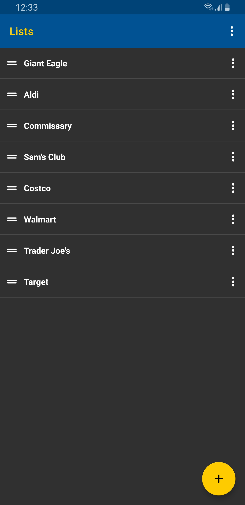

# Lists

Keeps lists synchronized across different devices.

An APK is [available](https://github.com/DavidPrecopia/Lists/releases/download/v2.2/lists-v2.2.apk).

**Technical Features**

- Firebase's [Cloud Firestore](https://firebase.google.com/docs/firestore) to synchronize between Android devices.
  - Offline on-device storage.
  - [Cloud Firestore Security Rules](https://firebase.google.com/docs/firestore/security/get-started) written from-scratch to provide user, data, and access validation.
  - [Cloud Functions](https://firebase.google.com/docs/functions), written in JavaScript, automatically and remotely delete the contents of a list when a list is deleted by the user.
- Firebase Authentication to authenticate users.
  - Users can authenticate via their Google account, a phone number (verification via SMS), or email and password (with email verification).
  - User can delete their account from within the app. A user's data will be automatically deleted when they do so.
- MVP-like architecture with dependency injection via Dagger2.
  - View: Fragments set-up as Passive Views. I use a single Activity architecture with Jetpacks' [Navigation library](https://developer.android.com/guide/navigation).
  - Logic: Similar to a presenter. Extends Jetpacks' [ViewModel](https://developer.android.com/topic/libraries/architecture/viewmodel) to store and restore data to the View in a lifecycle conscious way.
  - ViewModel: A cache for the View. Additionally, it retrieves user-facing messages, which requires holding a reference to the Android framework.
  - Repository: It hides the implementation details from the front-end. There are separate repositories for data storage and the user management.
- Multi-module
  - App module
    - Front-end.
    - Logic classes and their respective Views and ViewModels.
    - Dagger 2.
  - Domain module
    - Contains the app's solution its problem domain.
    - The Interface that the repository will implement and the front-end will use to talk to the repository. Only RxJava observables are returned, Flowables and Completables specifically.
    - Data models for the View.
  - Data module
    - Implementation specific details for how data is stored and handled.
    - Repositories for data storage and the user management.
    - Data models for the back-end.
- Multithreading with RxJava 2.
- [Firebase Crashlytics](https://firebase.google.com/docs/crashlytics/) for crash reporting.
- Unit testing with JUnit 5, AssertJ, and MockK.
- Originally written in Java, completely converted to Kotlin.
  - When the app was written in Java, JUnit 4 and Mockito was used for unit testing.

**Features**

- Automatically backs-up all of your lists to off-site.
- Synchronized all of your lists between different devices.
  - Requires the creation of an account (supported methods below).
- All lists are stored on your device for offline access.
- Night mode
- Drag to rearrange
- Supports keyboard navigation.
- Available authentication methods:
  - Google account
  - Email
  - Phone number

# Screenshots

Sign-in

Main screen

    

Inside of a list

Preferences

Night mode

# Resources

**Icons**

- https://material.io/tools/icons/?style=round

## License

    Copyright (c) 2018-present, David M Precopia.

    Licensed under the Apache License, Version 2.0 (the "License");
    you may not use this file except in compliance with the License.
    You may obtain a copy of the License at

    http://www.apache.org/licenses/LICENSE-2.0

    Unless required by applicable law or agreed to in writing, software
    distributed under the License is distributed on an "AS IS" BASIS,
    WITHOUT WARRANTIES OR CONDITIONS OF ANY KIND, either express or implied.
    See the License for the specific language governing permissions and
    limitations under the License.
